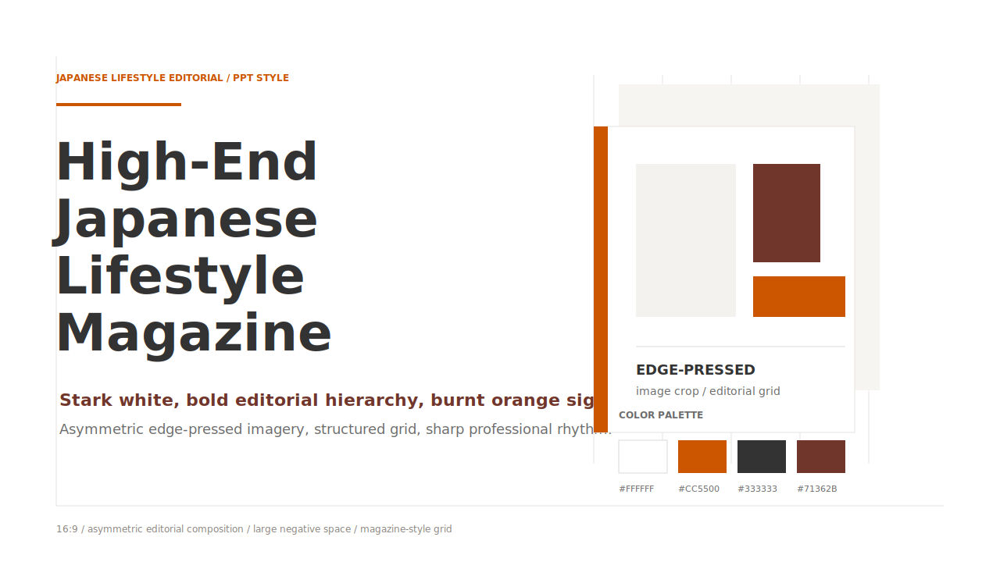
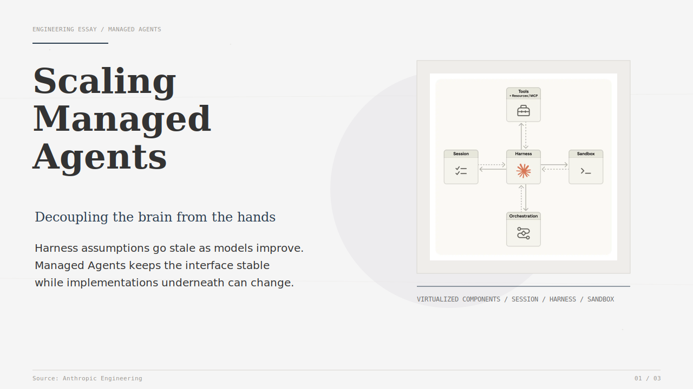
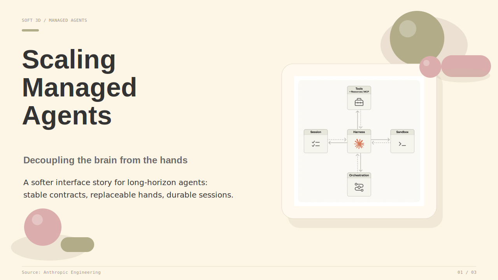
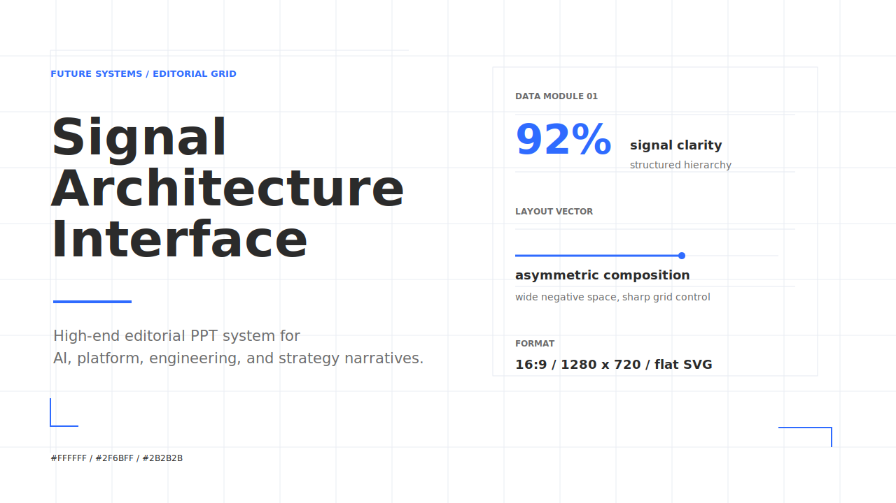
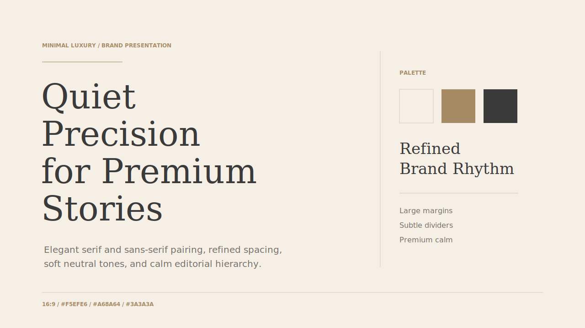
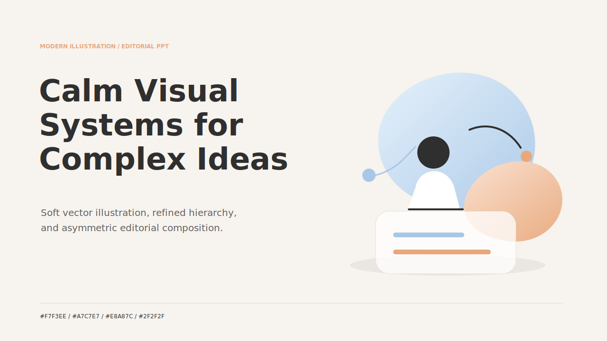
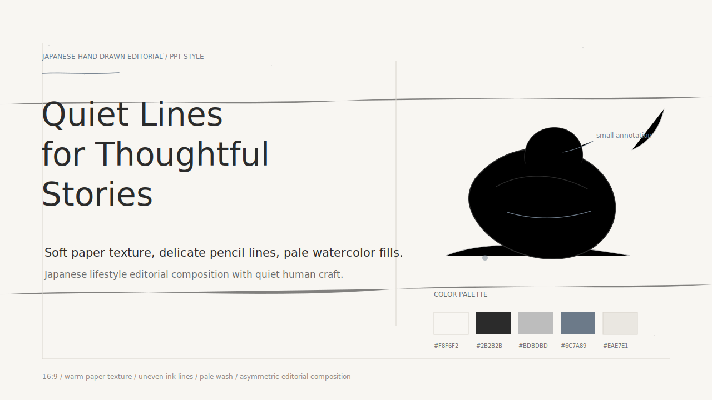

# Awesome PPT Design Skill

[繁體中文](README.md) | [English](README.en.md)

> 一句 prompt，讓 Codex 依照指定美學產出可交付的高質感 PPT。

Custom Codex skills for generating polished PowerPoint decks with [`ppt-master`](https://github.com/hugohe3/ppt-master).

這個 repo 收集一組可直接套用的 PPT design skills，重點不是「套模板」，而是讓 agent 在產製簡報時能穩定遵守一套完整的視覺語言：色彩、排版、字體、留白、封面、圖表、QA 與 PPT master 流程。

繁體中文友善：你可以直接用繁體中文描述需求、指定風格、要求頁數、提供 PDF，skill 會以繁中語境理解簡報敘事與視覺方向。

```text
Use japanese-style-ppt-skill and follow ppt-master to create a 5-page PPT from this PDF.
請使用 minimalist-luxury-branding-ppt-skill，根據這份文件做一份 6 頁高端品牌提案簡報。
```

## Style Gallery

| Skill | Cover | Best For |
| --- | --- | --- |
| `japanese-style-ppt-skill` / Japanese Lifestyle Editorial |  | 品牌故事、商務提案、產品敘事、具雜誌感的專業簡報 |
| `japanese-style-ppt-skill` / Washi Paper & Soft Glow |  | 人文敘事、溫度型商務簡報、品牌理念、策略故事 |
| `soft-3d-clay-ppt-skill` |  | 輕盈科技簡報、友善產品說明、活潑但專業的策略簡報 |
| `futuristic-tech-editorial-ppt-skill` |  | AI、平台、工程、技術策略、資料導向商務簡報 |
| `minimalist-luxury-branding-ppt-skill` |  | 高端品牌提案、公司簡介、創辦人簡報、精品感商務敘事 |
| `modern-illustration-editorial-ppt-skill` |  | 產品故事、策略解釋、工作流程、概念型插畫簡報 |
| `japanese-hand-drawn-editorial-ppt-skill` |  | 人文品牌、生活風格、創意流程、安靜細膩的概念型簡報 |

## What You Can Make

| Capability | Output | Typical Use |
| --- | --- | --- |
| PDF to PPT | 依文件內容重組的多頁簡報 | 技術文章、研究報告、產品文件、商業提案 |
| Style-directed deck | 依指定 skill 產製完整視覺系統 | 同一份內容快速切換不同設計氣質 |
| PPT master workflow | `design_spec.md`、`spec_lock.md`、SVG pages、PPTX export | 需要穩定輸出與可檢查流程 |
| Cover and visual QA | 每個 skill 內建 cover reference 與 QA checklist | 避免顏色、留白、圖表與字級跑偏 |
| Traditional Chinese prompts | 支援繁體中文需求描述與內容整理 | 中文簡報、中文商務提案、雙語簡報 |

## Included Skills

### `japanese-style-ppt-skill`

日本風格高端編輯簡報系統，包含兩種 house style。

**Washi Paper & Soft Glow**

- 和紙感米白背景
- 柔和微光與低彩度色系
- 細灰線、靛藍克制點綴
- 大量留白、安靜但有溫度

**Japanese Lifestyle Editorial**

- 純白背景
- 焦橙與深炭灰
- 高端生活雜誌式排版
- 非對稱壓邊圖片與結構化 grid

### `soft-3d-clay-ppt-skill`

柔和 3D / Claymorphism 風格。

- 暖米色 `#FDF5E6`
- 鼠尾草綠 `#B2AC88`
- 莫蘭迪粉 `#DBADAD`
- 柔霧感幾何形狀
- 空氣感、現代、友善，但仍保持專業

### `futuristic-tech-editorial-ppt-skill`

未來科技雜誌風格。

- 純白背景 `#FFFFFF`
- 電光藍 `#2F6BFF`
- 石墨灰 `#2B2B2B`
- 細線 grid、資料感模組、非對稱留白
- 無陰影、無 3D、平面且銳利

### `minimalist-luxury-branding-ppt-skill`

高端品牌提案風格。

- 暖米色 `#F5EFE6`
- 柔棕色 `#A68A64`
- 深灰文字 `#3A3A3A`
- 襯線標題 + 無襯線內文
- 大邊距、低密度、精品感節奏

### `modern-illustration-editorial-ppt-skill`

現代插畫型高端編輯簡報。

- 柔米色 `#F7F3EE`
- 霧藍 `#A7C7E7`
- 灰橘 `#E8A87C`
- 炭灰 `#2F2F2F`
- 柔和向量插畫、輕微漸層、克制陰影

### `japanese-hand-drawn-editorial-ppt-skill`

日系手繪編輯簡報風格。

- 暖白紙感背景 `#F8F6F2`
- 墨黑線條 `#2B2B2B`
- 柔灰 `#BDBDBD`
- 低彩靛藍 `#6C7A89`
- 細緻鉛筆/墨線插畫、淡水彩填色、略帶不完美的筆觸

## Quick Start

把需要的 skill folder 複製到 Codex skills 目錄，或放在 Codex 能讀取的 workspace 內。

使用時直接指定 skill 名稱與 `ppt-master` 流程：

```text
請使用 japanese-style-ppt-skill 裡的 Washi Paper & Soft Glow 風格，
遵照 ppt-master，根據這份 PDF 產出 5 頁 PPT。
```

```text
Use futuristic-tech-editorial-ppt-skill and follow ppt-master
to create a 3-page technical strategy PPT from this PDF.
```

```text
請使用 modern-illustration-editorial-ppt-skill，
把這份產品策略文件整理成 6 頁繁體中文簡報。
```

## PPT Master Workflow

搭配 [`ppt-master`](https://github.com/hugohe3/ppt-master) 時，建議把 skill 當成視覺風格層，並讓流程依序產出：

1. 內容摘要與頁面規劃
2. Eight Confirmations
3. `design_spec.md`
4. `spec_lock.md`
5. 每頁 SVG
6. 視覺 QA
7. PPTX export

`ppt-master` 可以把產製出的簡報頁面轉成可修改的 `.pptx`，讓文字、圖形與版面能在 PowerPoint 裡繼續編輯，而不是只能輸出成不可調整的圖片。

每個 skill 都提供：

- `SKILL.md`: 觸發條件與核心風格指令
- `references/style-system.md`: 色彩、字體、版面、圖表與圖像規則
- `references/slide-patterns.md`: 可重複使用的頁型
- `references/ppt-master-integration.md`: PPT master 產製規則
- `references/qa-checklist.md`: 交付前檢查清單
- `assets/examples/01_cover.svg`: 風格封面示意

## Design Principles

- 先讀懂內容，再套風格。
- 一頁只保留一個清楚訊息。
- 色彩是系統，不是裝飾。
- 留白要有意圖，不能只是空。
- 圖表與插圖要服務敘事。
- 封面、章節頁、資料頁、結論頁要有一致的視覺語言。
- 產製 PPT 前先過 QA checklist。

## Repository Structure

```text
.
|-- japanese-style-ppt-skill/
|   |-- SKILL.md
|   |-- agents/openai.yaml
|   |-- assets/
|   |   |-- template.html
|   |   |-- style2-template.html
|   |   `-- examples/
|   |       |-- japanese-lifestyle-editorial/
|   |       `-- washi-soft-glow/
|   `-- references/
|       |-- style-system.md
|       |-- japanese-lifestyle-editorial.md
|       |-- slide-patterns.md
|       |-- ppt-master-integration.md
|       `-- qa-checklist.md
|-- soft-3d-clay-ppt-skill/
|   |-- SKILL.md
|   |-- agents/openai.yaml
|   |-- assets/
|   |   |-- template.html
|   |   `-- examples/
|   `-- references/
|       |-- style-system.md
|       |-- slide-patterns.md
|       |-- ppt-master-integration.md
|       `-- qa-checklist.md
|-- futuristic-tech-editorial-ppt-skill/
|   |-- SKILL.md
|   |-- agents/openai.yaml
|   |-- assets/
|   |   |-- template.html
|   |   `-- examples/
|   |       `-- 01_cover.svg
|   `-- references/
|       |-- style-system.md
|       |-- slide-patterns.md
|       |-- ppt-master-integration.md
|       `-- qa-checklist.md
|-- minimalist-luxury-branding-ppt-skill/
|   |-- SKILL.md
|   |-- agents/openai.yaml
|   |-- assets/
|   |   |-- template.html
|   |   `-- examples/
|   |       `-- 01_cover.svg
|   `-- references/
|       |-- style-system.md
|       |-- slide-patterns.md
|       |-- ppt-master-integration.md
|       `-- qa-checklist.md
|-- modern-illustration-editorial-ppt-skill/
|   |-- SKILL.md
|   |-- agents/openai.yaml
|   |-- assets/
|   |   |-- template.html
|   |   `-- examples/
|   |       `-- 01_cover.svg
|   `-- references/
|       |-- style-system.md
|       |-- slide-patterns.md
|       |-- ppt-master-integration.md
|       `-- qa-checklist.md
`-- japanese-hand-drawn-editorial-ppt-skill/
    |-- SKILL.md
    |-- agents/openai.yaml
    |-- assets/
    |   |-- template.html
    |   `-- examples/
    |       `-- 01_cover.svg
    `-- references/
        |-- style-system.md
        |-- slide-patterns.md
        |-- ppt-master-integration.md
        `-- qa-checklist.md
```

## Limits

- 這些 skills 是風格與流程規範，不是固定模板。
- 最終品質仍取決於來源文件品質、頁數限制與 PPT master 執行結果。
- 若有正式品牌規範，請優先提供 logo、色票、字體與品牌 guideline。
- 若沒有品牌素材，skill 會使用內建風格系統作為 fallback。
